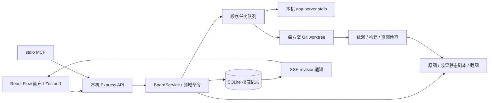

# 项目画板架构

`src/project-canvas` 是默认产品界面。`runtime/project-canvas/domain.mjs` 处理要求版本、作用范围、上下文和人工验收；`store.mjs` 通过事务与 revision 保存完整项目文档。每个数据目录有进程锁，防止两个服务重复调度。

`service.mjs` 串联持久化与外部副作用。先保存 queued 任务和冻结输入，再依次运行。`workspaces.mjs` 管理独立仓库、历史提交、worktree、依赖与构建；路径从项目 ID 和方案 ID 解析，客户端不直接指定执行目录。

`runner.mjs` 复用 `runtime/agents/codex.cjs` 的本机运行连接，新增只读讨论 / 明确开发两种模式。运行记录包含实际投递提示、正式要求指纹、原图版本、代码来源、模型会话、真实 turn ID、工具事件和检查输出。私有推理事件不保存为项目内容。

要求与对话的身份独立：项目关系用于“适用于、参考、产出、替代、验收”；对话 parentIds 才形成模型上下文 DAG。正式要求从目标及其上级继承，额外参考由用户选择。候选不会自行生效。

一次成功开发需要正常结束、构建/测试通过、静态页面可运行和截图成功，之后才生成成果。成果仍为待验收；只有人工验收会改变验收状态。失败和取消保存现场提交。规范新版本通过指纹比较标记有关成果需复核，既不覆盖历史也不触发自动重做。

采纳记录 `currentArtifactId` 与 `currentBranchId`。后续讨论从采纳成果的具体 commit 开始；选择历史对话时使用它自己冻结的 commit。历史成果的静态副本不依赖后来 worktree 的修改。

启动时将未结束记录标为 interrupted，核对原运行进程及 exact turn；保存可核对的代码现场，不自动重发。UI 通过 SSE revision 重新读取服务端文档。关浏览器、刷新、MCP 修改都不会产生另一套权威状态。

原版探索前端保留为 `/explore` 和 `src/legacy-main.tsx`，仍使用上游 IndexedDB 与代理接口。项目画板的“只看对话分支”是统一 SQLite 数据的视图过滤。原版 README、CLI、文档和桌面分发源码作为上游兼容内容保留，本次本机产品不依赖其发布流程。
