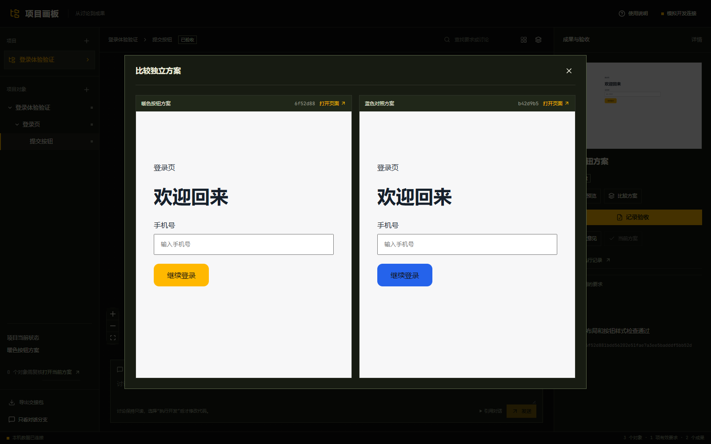
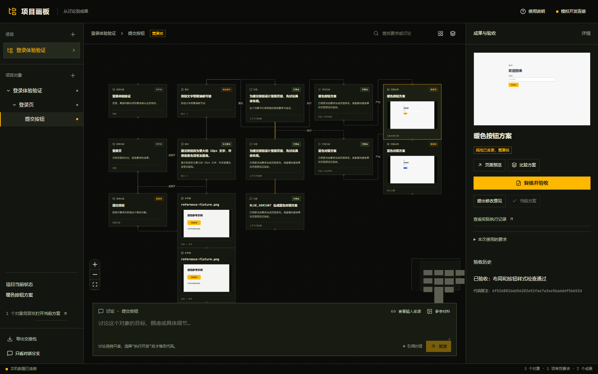
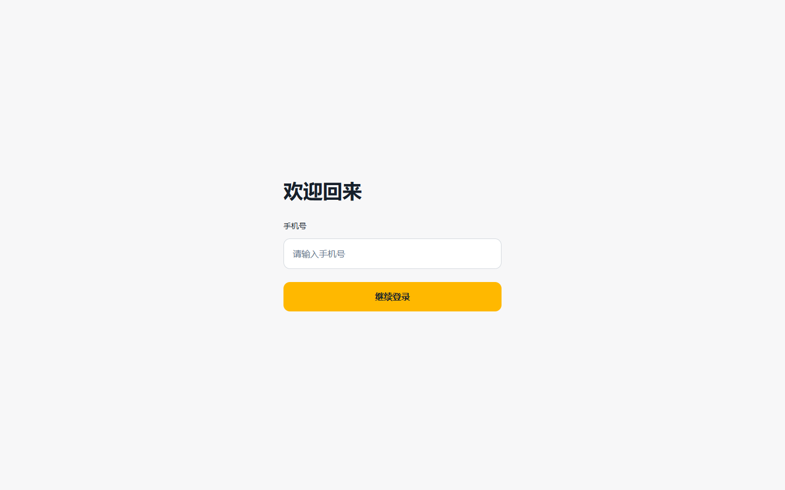
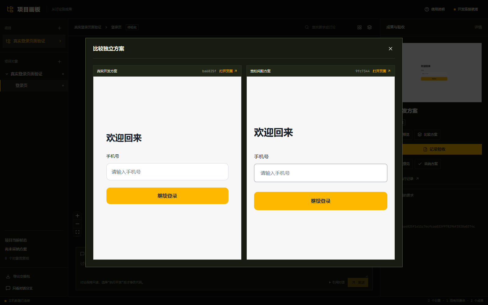
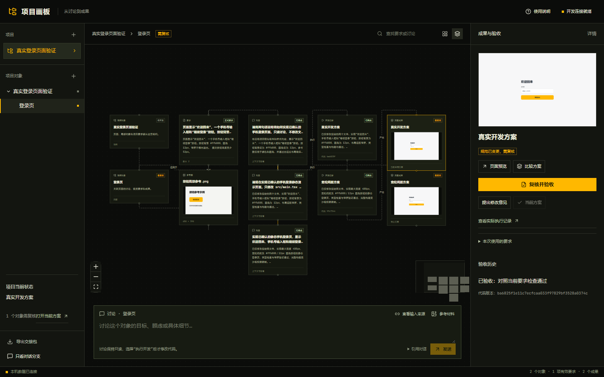

# V1 验收记录

环境：Windows、本机浏览器、Node 24，项目目录包含中文。以 ThoughtDAG v0.5.9 为底座。

| 验收场景 | 实现与验证 |
| --- | --- |
| 圈选视觉要求 | 原图、归一化矩形、采纳/排除文字和 SHA-256；浏览器调整画布缩放及窗口宽度后标注仍匹配 |
| 候选确认后生效 | 未确认不进入正式规范；冻结上下文可查实际要求与参考版本 |
| 两个独立方案 | 相同历史提交创建两份 worktree；独立提交、静态页面和截图；并排预览 |
| 采纳与迭代 | 精确采纳 artifact/commit；其他成果保留；修改意见回填关联代码版本的草稿 |
| 规范影响范围 | 局部变更只标记有关成果；新验收保留旧记录；不自动发起开发 |
| 失败、取消和重启 | 失败构建无成果；队列/执行/检查阶段取消不伪造成功；重启核对 exact turn、保存现场、不重发 |
| 持续使用与 MCP | 真正关闭服务后恢复画布、素材、成果和历史；stdio MCP 与 UI 共用 SQLite，SSE 通知 revision |

自动化流程的 Agent 为模拟实现，实际构建、Git 操作、浏览器截图和预览均真实运行。测试通过 30 项，另有上游布局检查和 Playwright 完整流程。

本机默认模型的真实接入也已完成只读讨论和前端开发，成功构建、保存提交并截图：

完整真实演示也已通过：两个实现从相同历史提交开始，在画板中比较、验收、采纳，再更新规范并检查窄屏页面。原方案完成复核，另一个方案保持需复核，规范更新没有自动启动开发。

运行证据写入本机 `output/playwright/verification.json`、`live-verification.json` 与 `live-demo-verification.json`，保存项目、执行、提交及检查结果。真实记录与模拟记录分别标明。复现方式见 [TESTING.md](../../TESTING.md)。

范围与实现方式：保留 React Flow、Markdown、箭头顺序布局及本机 Agent 桥接；项目模式新增统一持久化与对象流程。原版探索界面作为独立兼容模式，不参与项目 SQLite；同一项目的纯对话视图使用“只看对话分支”。导入时记录已有预览脚本，成果预览使用冻结静态构建副本。
